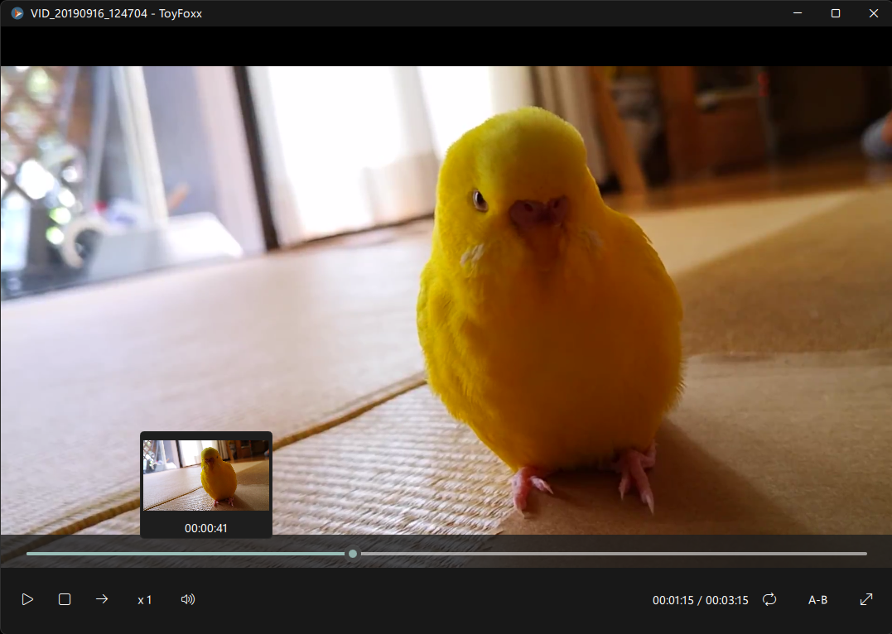

# ToyFoxx - a tiny media player
Limited, buggy, and uncustomizable, but perfect for me.



**Note:** This project is the successor to [ToyBoxx](https://github.com/tackme31/ToyBoxx), rewritten from scratch in Qt Quick and C++ for smooth 4K playback.

## Features

- 🖼️ Preview thumbnails when hovering over the seek bar
- 🔁 Loop playback within a selected range
- 🔍 Transform media
  - Zoom in and out (`Ctrl` + Mouse Wheel)
  - Pan (Drag)
  - Rotate 90° clockwise (`R`)
  - Display at original size (`F`)
  - Reset view to default (`Middle click`)
- ⚡ Adjust playback speed
- ⏭️ Step forward one frame
- 📸 Capture the current frame (`S`)
- ⏱️ Jump backward or forward 5 seconds (`Left` / `Right`)
- 🖥️ Toggle fullscreen (`Double click`)

## Build
This software is only supported on Windows x64. It requires Qt 6.11 or newer (MSVC 2022 x64 build, with the Multimedia and Svg modules) and the MSVC 2022 x64 toolchain.
FFmpeg is not a separate dependency: Qt's FFmpeg media backend ships with Qt and is deployed by `windeployqt`.

Run the following commands from an x64 Native Tools Command Prompt for VS 2022, with Qt's `bin` directory and `Tools/Ninja` on `PATH`:

```console
$ git clone --recursive https://github.com/tackme31/ToyFoxx.git
$ cd ./ToyFoxx
$ qt-cmake -S . -B build -G Ninja -DCMAKE_BUILD_TYPE=Release
$ cmake --build build
$ windeployqt --qmldir ./src/qml ./build/ToyFoxx.exe
```

## Author

- Takumi Yamada (X: [@tackme31](https://x.com/tackme31))

## License

This software is licensed under the MIT license. See [LICENSE](./LICENSE).

It uses the following third-party components, which are distributed under their own licenses:

- [Qt](https://www.qt.io/) - LGPLv3
- [FFmpeg](https://ffmpeg.org/) (bundled with Qt Multimedia) - LGPLv2.1 or later
- [QWindowKit](https://github.com/stdware/qwindowkit) - Apache License 2.0
